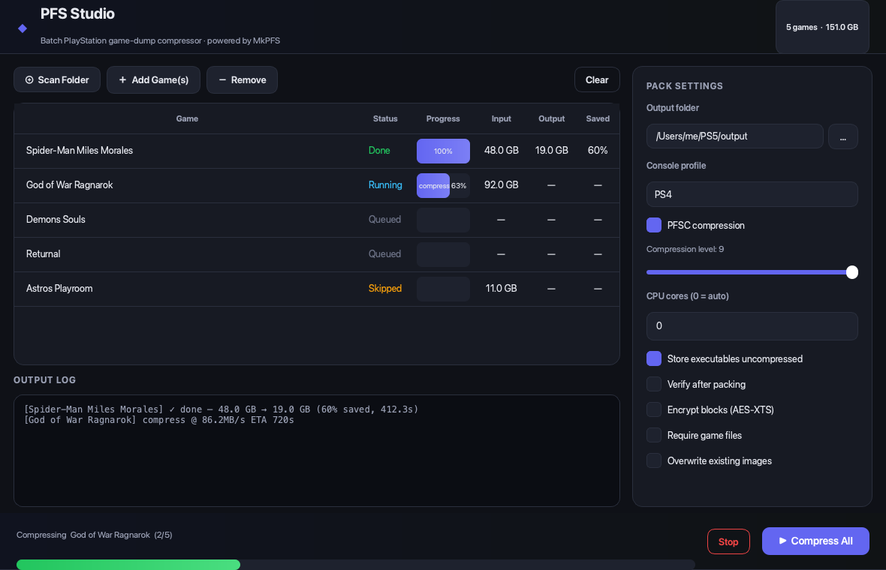

# PlayStation Studio

A modern PySide6 desktop app that combines two tools in one window:

- **PS4 · PKG Manager** — browse, inspect, rename, export and remote-install
  PS4 `.pkg` files.
- **PS5 · PFS Compressor** — batch-compress PS5 game dumps into PFS images via
  the bundled [MkPFS](https://github.com/PSBrew/MkPFS) engine.



## Features

### PS4 PKG Manager
- **Scan a folder** of `.pkg` files; they're sorted into **Games / Updates / DLC**
  by reading each package's `param.sfo` (pure-Python parser, no deps).
- **Details panel** with cover art (`icon0.png`) and every metadata field.
- **Filter** the current list instantly.
- **Bulk rename** by template — `[TITLE] [TITLE_ID] [SIZE] [CATEGORY] [SYS_VER] [VER]`.
- **Export to Excel** (one sheet per category).
- **Remote install** to a jailbroken PS4 (Remote PKG Installer on `:12800`) with a
  built-in HTTP server and live per-package progress.
- **Auto-Detect** consoles on your LAN (Sony Device Discovery Protocol on
  UDP 987/9302, plus a TCP fallback sweep for homebrew loader ports).
- **Exploit host** — serve the bundled exploit-host site.

### PS5 PFS Compressor
- **Recursive Scan Folder** with adjustable depth, plus drag & drop.
- **Batch queue** with per-game progress, size in/out and space saved.
- **All the knobs** — compression level, CPU cores, verify, AES-XTS, etc.

### Payload Sender
- Send **`.elf` / `.bin` / `.jar`** payloads to a **PS4 or PS5** over TCP.
- Set the **console IP + port** (with quick presets for common loader ports),
  add a payload list (drag & drop too), and **Send**.

### FTP Client  *(Phase 1)*
- Connect to any **FTP** server — host/port, passive/active, anonymous login.
- **Dual-pane** local ⇄ remote browser with up/refresh and folder navigation.
- **Upload / download** with a live **transfer queue** (progress, speed, status).
- **Site Manager** — save sites (host, port, creds, folders, notes, favorites);
  passwords go to the OS keyring when `keyring` is installed.
- Roadmap: sync, scheduler, search, preview, bookmarks, history, bandwidth
  limiting, multi-threaded transfers.

### Persistent settings
- All IP addresses, ports and folder paths are saved to
  `~/.playstation_studio/config.json` and restored on the next launch.

## Quick start

```bash
./run.sh
```

`run.sh` creates a virtual environment, installs dependencies and the bundled
MkPFS engine the first time, then launches the app.

### Manual setup

```bash
python3 -m venv .venv
.venv/bin/python -m pip install -r requirements.txt
.venv/bin/python -m pip install ./MkPFS      # the PS5 engine
.venv/bin/python -m playstation_studio       # run
```

> Requires Python 3.8+.

## Build a standalone app (no Python needed)

To produce a standalone app that bundles Python, Qt, the engine and all assets
— so end users don't install anything:

**macOS / Linux:**
```bash
./build_app.sh        # → dist/PlayStation Studio.app  (mac) or dist/PlayStation Studio/ (Linux)
```

**Windows:**
```bat
build_app.bat         REM → dist\PlayStation Studio\PlayStation Studio.exe
```

It uses [PyInstaller](https://pyinstaller.org) via `playstation_studio.spec`,
which picks the right app icon per OS (`app.icns` on macOS, `app.ico` on
Windows). The frozen build re-invokes its own executable (`--run-mkpfs`) to run
the PS5 engine, since there is no system `python` to call.

> **PyInstaller does not cross-compile.** Build the Windows `.exe` *on Windows*,
> the macOS `.app` *on macOS*, etc. To build all three from one place, use CI
> (e.g. a GitHub Actions matrix on `windows-latest` / `macos-latest` /
> `ubuntu-latest`, each running its build script and uploading `dist/`).

> Distributing to *other* machines also needs code-signing (and notarization on
> macOS) so the OS doesn't block an unsigned app — that's a separate, account-
> specific step.

## Project layout

One app package, with each sub-folder named for what it does:

```
playstation_studio/
  app.py                 # QApplication bootstrap + theme
  __main__.py            # `python -m playstation_studio`
  interface/             # the app window frame
    shell.py             #   menu bar (File/View/Help) + tab navigation + status bar
  ps4_manager/           # everything PS4
    library_tab.py       #   the PS4 PKG Manager tab (UI)
    pkg_parser.py        #   .pkg / param.sfo reader + icon extractor
    remote_install.py    #   HTTP server, connectivity test, remote installer
    rename.py            #   bulk-rename engine
    exploit_host/        #   static exploit-host site served on :80
  ps5_compressor/        # everything PS5
    compressor_tab.py    #   the PS5 PFS Compressor tab (UI)
    jobs.py              #   Job model, PackSettings, mkpfs command builder
    runner.py            #   QProcess batch runner + progress parsing
  payload_sender/        # send payloads to a console
    sender_tab.py        #   the Payload Sender tab (UI)
    sender.py            #   TCP send thread + port presets
  ftp_client/            # FTP client (FileZilla-style)
    ftp_tab.py           #   dual-pane UI + transfer queue
    ftp_engine.py        #   ftplib wrapper + serialized worker thread
    sites.py             #   Site Manager (keyring-backed credentials)
    site_dialog.py       #   add/edit/delete sites dialog
  shared/                # used by every feature
    theme.py             #   color palette + Qt stylesheet
    formatting.py        #   human-readable size helpers
    config.py            #   JSON settings store (IPs, ports, paths)
    assets.py            #   icon loaders (QIcon / QPixmap)
  assets/                # bundled icon set
    build_icons.py       #   regenerates the SVGs + PNGs
    svg/                 #   5 source icons (app + one per tab)
    icons/               #   rendered PNGs, 16 → 1024 px (desktop + mobile)
MkPFS/                   # bundled upstream PS5 compression engine
run.sh
```

## Notes

- The PS4 logic is a modernized port of the original PS4 PKGs Manager: the
  Twisted server was replaced with Python's stdlib `http.server`, and Excel
  export now uses `openpyxl` — fewer, lighter, cross-platform dependencies.
- MkPFS is GPLv3 (see `MkPFS/LICENSE`). This GUI is a separate front-end.
