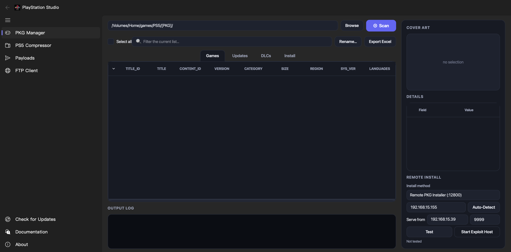

<div align="center">


# PlayStation Studio

### All-in-one desktop toolkit for PS4 / PS5 homebrew

**PKG manager & remote installer · PS5 PFS compressor · payload sender · FTP client**


-0a84ff)




</div>

---

## Overview

**PlayStation Studio** bundles the everyday PS4/PS5 homebrew chores into one clean desktop
app with a **Fluent left-navigation UI**. Manage and remote-install PKGs, compress PS5 game
dumps into mountable PFS images (and extract them back), send payloads, and move files to and
from your console over FTP — all from one window. It updates itself from inside the app.

> For managing **your own** legally-owned backups on consoles **you** own and have modified.
> It ships no game content and bypasses no copy protection.

---

## ✨ Features

### The app
- **Fluent left-navigation UI** — every tool is one click away in the side menu: PKG Manager,
  PS5 Compressor, Payloads, FTP Client.
- **In-app updater** — **Check for Updates** in the side menu compares your version to the
  latest GitHub release and, on packaged builds, downloads and installs it in place, then
  relaunches. No manual re-download.
- **Built-in Documentation & About**, dark theme, runs on **Windows 10/11** and **macOS**.

### 🎮 PKG Manager
A scannable PKG library with one-click remote install.

- **Scan a folder** of PKGs and read each package's metadata from its `param.sfo` —
  **Title, Title ID (CUSA), Content ID, Version, Category, Region, System version, Languages**.
- **Cover art** pulled from each package, shown as a thumbnail.
- **Games / Updates / DLC** are auto-sorted into their own tabs (by package category).
- **Rename** packages to a clean, consistent scheme — straight from the library.
- **Export to Excel** — dump the whole library to a `.xlsx` spreadsheet.
- **Search / filter** the list live.
- **Tick-to-queue** — ticking a game automatically pulls in its matching **update + DLC**
  (grouped by Title ID), so a whole title installs together. **Install Selected** or
  **Install All**, **Remove Selected**, or **Clear**.
- **Remote install** over the network, **one package at a time** (back-to-back installs crash
  the console's installer, so they're strictly sequential):
  - **PS4** — flatz **Remote PKG Installer** (`:12800`)
  - **PS5** — **etaHEN DPI** v2 (`:12800`) and v1 (`:9090`)
  - Real console error codes are decoded (e.g. *already installed*, *base game missing*).
- **Built-in HTTP server** serves the packages to the console; an optional **exploit host**
  is bundled for PS4.

### 🗜 PS5 PFS Compressor
Batch-compress PS5 game dumps into mountable images — powered by **MkPFS 0.0.8**.

- **Output format selector** — **Compressed PFS (`.ffpfsc`)** for smaller files, or
  **Uncompressed PFS (`.ffpfs`)** for full read speed. Both mount under **ShadowMountPlus /
  MicroMount**.
- **Selectable compression level** (0–9) for `.ffpfsc`.
- **Extract** — unpack any `.ffpfs` / `.ffpfsc` image back to a folder (batch, with a live
  log).
- **ShadowMountPlus-compatible** mode (≥ 32 KiB block) and **auto block size** to shrink
  games with thousands of tiny files.
- **Estimate** the packed size and padding before you commit.
- **Batch queue** with **Compress Selected / All**, drag-and-drop, size-weighted progress, a
  **history** of past jobs, configurable **CPU cores**, **temp-folder** policy, low-memory
  mode, and disk-space pre-flight checks.

### ➤ Payload Sender
- Send **ELF / BIN / JAR** payloads to a console over TCP (e.g. etaHEN, GoldHEN).
- Saved payload list with host/port settings.

### 🌐 FTP Client
A dual-pane FTP client for moving files to and from a jailbroken console.

- **Dual-pane** local ⇄ remote browsing with **drag-and-drop**.
- **File operations** — upload, download, **rename**, delete (recursive), create folder, move,
  copy, refresh.
- **Transfer queue** with progress, speed and ETA; large folders start transferring
  immediately while the rest enumerate in the background.
- **Site Manager** — save connections (host, port, credentials, anonymous, passive,
  local/remote dirs) with optional OS-keyring password storage.
- **Auto-detect** PS4/PS5 consoles with an FTP server on your network.

---

## ⬇️ Download & Install

Grab the latest build from the **[Releases page](https://github.com/dirazi83/PSS/releases/latest)**:

| Platform | File |
|---|---|
| Windows 10/11 (x64) | `PlayStation-Studio-Windows.zip` |
| macOS (Apple Silicon) | `PlayStation-Studio-macOS.zip` |

The builds are **unsigned**, so the OS warns on first launch:

- **macOS** — right-click the app → **Open** → **Open**.
- **Windows** — **More info** → **Run anyway** (SmartScreen).

### "This download may be a virus" / the browser blocks the zip
This is a generic, heuristic false positive that hits unsigned PyInstaller apps — there is no
known malware in the build. To allow it: click the ⋯ menu on the blocked download →
**Keep** / **Keep anyway**, or download it from the
[Releases page](https://github.com/dirazi83/PSS/releases/latest) directly. Each release also
ships SHA-256 checksums you can verify.

---

## 🛠 Run from source

```bash
python -m pip install -r requirements.txt
python -m pip install ./MkPFS        # the PS5 compression engine
python -m playstation_studio
```

Python **3.11+**. If `PySide6-Fluent-Widgets` isn't installed the app automatically falls back
to a classic tabbed shell, so it still runs.

### Build your own standalone app

```bash
python -m pip install -r requirements.txt pyinstaller pillow ./MkPFS
python -m playstation_studio.assets.build_icons
pyinstaller --noconfirm playstation_studio.spec
```

---

## 🧩 Troubleshooting

- **PS4 install fails with _"Unable to set up prerequisites"_** — the app waits for its HTTP
  server to bind before contacting the console, and serves packages under an ASCII-safe URL
  (filenames with spaces / `™` / `()` are handled). If it still fails on Windows, allow
  **PlayStation Studio** through **Windows Defender Firewall** on Private networks.
- **A package shows "already installed"** — that's the console reporting `0x80990015`; it's not
  an error. Delete the existing copy to reinstall the base, or just install the update/DLC.
- **`.exfat` / `.ffpkg`** — not supported: those formats need Windows-only kernel drivers
  (OSFMount / Dokan) and admin rights. PlayStation Studio focuses on PFS (`.ffpfs` / `.ffpfsc`).

---

## 🙏 Credits

- **PS5 compression engine:** [MkPFS](https://github.com/PSBrew/MkPFS) **0.0.8** by **PSBrew** —
  inspired by **PS5-FFPFSC-PRO** by KINGDKAK.
- **PS4 remote install:** [Remote PKG Installer](https://github.com/flatz/ps4_remote_pkg_installer)
  by **flatz**.
- **PS5 install:** **etaHEN** DPI.
- **UI:** [PySide6-Fluent-Widgets](https://github.com/zhiyiYo/PyQt-Fluent-Widgets) by zhiyiYo,
  built on **PySide6 / Qt**.
- Output is **ShadowMountPlus**-compatible.

---

## 📄 License

PlayStation Studio is licensed under the **GNU General Public License v3.0 (GPLv3)** — it bundles
the GPLv3 **PySide6-Fluent-Widgets** UI library, so the whole application is distributed under
GPLv3. See the dependencies' own licenses for their terms.

---

## Changelog

### v1.0.5
- **New Fluent left-navigation UI** — a side menu lists PKG Manager, PS5 Compressor, Payloads
  and FTP Client, with Check-for-Updates / Documentation / About at the bottom. The app falls
  back to the classic tabbed shell if the Fluent library is unavailable.
- **PS5 Compressor: output format selector** (`.ffpfsc` vs `.ffpfs`) and **PFS extraction**
  (unpack an image back to a folder).
- Fixed macOS text clipping in dropdowns/inputs; Pack Settings grouped into
  Output / Performance / Advanced with a scroll area.
- Licensed under **GPLv3** (PySide6-Fluent-Widgets dependency).

### v1.0.4
- Re-scanning a different PKG folder now re-maps the package HTTP server.
- Documentation & About render as in-app HTML.

### v1.0.3
- **In-app updater** (Help → Check for Updates).
- One-at-a-time PS4 installs (fixes the Remote PKG Installer crash) + **Install / Remove
  Selected**.
- Decoded console error codes (`0x80990015` → *already installed*).
- Fixed _"Unable to set up prerequisites"_ for filenames with spaces / `™` / `()`.

### v1.0.2 / v1.0.1 / v1.0.0
- MkPFS engine updated to **0.0.8**; async scanning and non-blocking FTP; Windows filename
  sanitisation; antivirus / SmartScreen mitigations; initial release.

---

## Disclaimer

This tool is for managing your own legally-owned PS4/PS5 backups on consoles you own and have
modified yourself. It does not bypass copy protection, includes no game content, and is not
affiliated with or endorsed by Sony Interactive Entertainment. PlayStation and PS5 are
trademarks of Sony Interactive Entertainment. Back up anything you care about before use.
