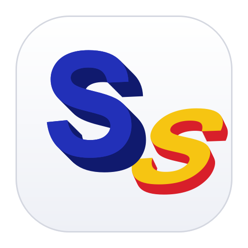
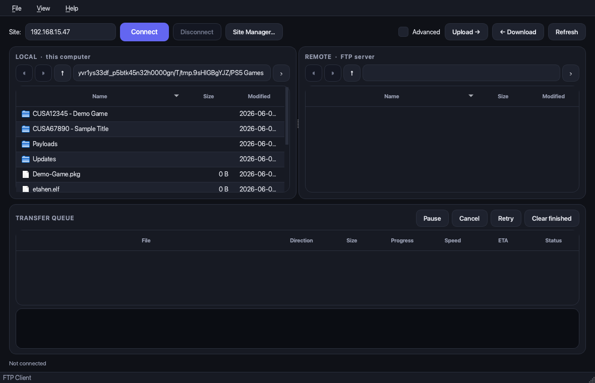
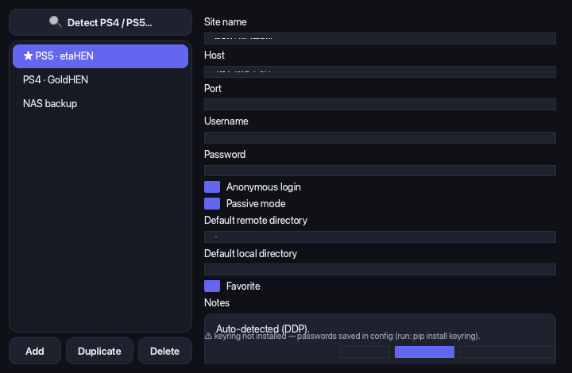
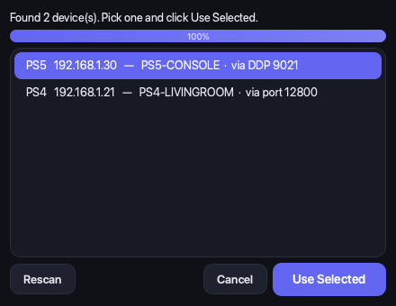
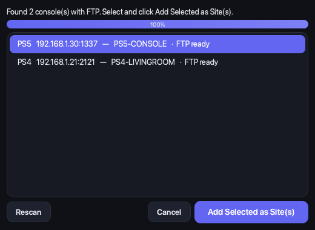
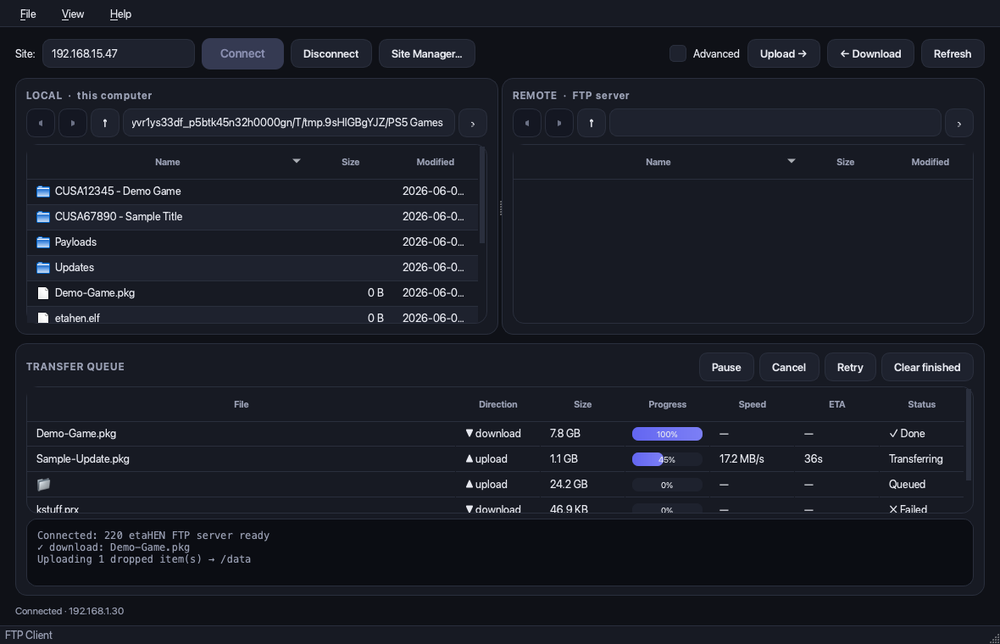
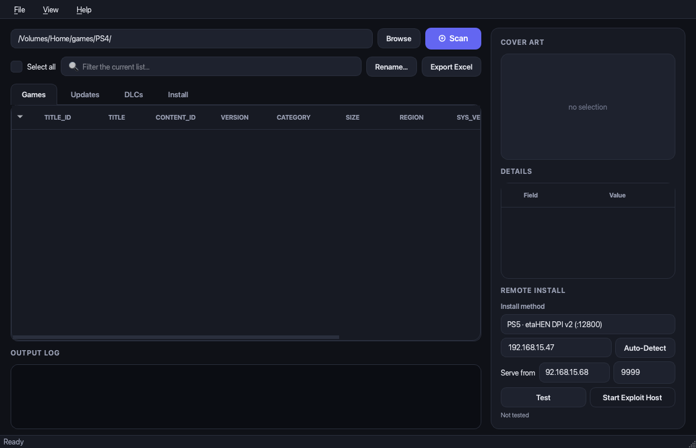
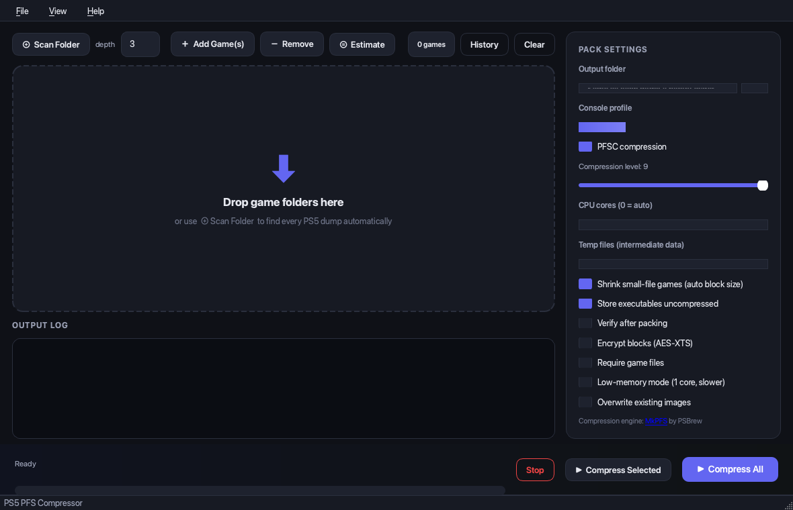
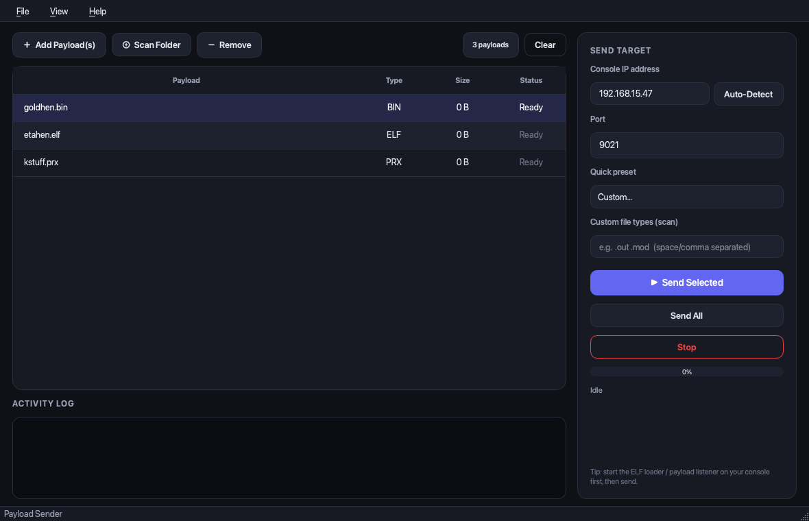

<div align="center">



# PlayStation Studio

### All-in-one toolkit for PS4 / PS5 homebrew — FTP client, payload sender, PKG manager & PFS compressor

**Version 1.0.0 — Initial Release**

A modern, cross-platform desktop application built with Python and PySide6. PlayStation
Studio brings a dual-pane FTP client, a network payload sender, a PKG library
manager, and a PS5 PFS compressor together in one clean, dark-themed window.



</div>

---

## Table of Contents

1. [Project Overview](#1-project-overview)
2. [Key Features](#2-key-features)
3. [Supported Platforms](#3-supported-platforms)
4. [Installation Guide](#4-installation-guide)
5. [Quick Start Guide](#5-quick-start-guide)
6. [Site Manager Configuration](#6-site-manager-configuration)
7. [FTP Connection Management](#7-ftp-connection-management)
8. [Auto Detection Features](#8-auto-detection-features)
9. [File Management Features](#9-file-management-features)
10. [Transfer Queue](#10-transfer-queue)
11. [Search Functionality](#11-search-functionality)
12. [Settings & Preferences](#12-settings--preferences)
13. [Theme Support](#13-theme-support)
14. [Keyboard Shortcuts](#14-keyboard-shortcuts)
15. [Troubleshooting](#15-troubleshooting)
16. [Security Notes](#16-security-notes)
17. [Changelog](#17-changelog)
18. [License](#18-license)
- [Screenshots](#screenshots)
- [Credits](#credits)

---

## 1. Project Overview

**PlayStation Studio** is a desktop companion for jailbroken PlayStation consoles. It
combines four tools that homebrew users normally juggle across separate apps into a
single, consistent interface:

| Module | What it does |
| --- | --- |
| **FTP Client** | FileZilla-style dual-pane browser with a full transfer queue, for managing files on a console's FTP server. |
| **Payload Sender** | Streams `.elf` / `.bin` / `.jar` and other payloads to a console's loader over TCP. |
| **PKG Manager** | Scans, inspects, renames, exports and remote-installs PS4 `.pkg` files. |
| **PS5 · PFS Compressor** | Batch-compresses PS5 game dumps into PFS images via the bundled [MkPFS](https://github.com/PSBrew/MkPFS) engine. |

Everything runs locally. Settings persist between sessions, the LAN is scanned to find
your console automatically, and the whole app ships as a single standalone build for
end users who don't have Python installed.

---

## 2. Key Features

- 🗂️ **Dual-pane FTP client** — local ⇄ remote browsing with history, multi-select and
  right-click menus.
- ⬆️⬇️ **Full file management** — upload, download, rename, delete, create folders, and
  refresh, for both files and entire folders (recursive).
- 📊 **Transfer queue** — per-item progress, live speed and ETA, with pause/resume,
  cancel, retry and clear.
- 🔍 **Auto-detect consoles** — Sony Device Discovery Protocol plus a TCP port sweep find
  PS4 / PS5 consoles on your network and add them as ready-to-connect sites.
- 🔒 **Secure Site Manager** — saved connections with passwords stored in your OS keyring.
- 🚀 **Payload sender** — send single, selected or all payloads with per-file status,
  plus custom file-type support.
- 💿 **PKG manager** — sort by Games / Updates / DLC, view cover art and metadata,
  bulk-rename, export to Excel, and remote-install.
- 🗜️ **PS5 PFS compressor** — batch compression with pre-flight size estimates,
  auto block-sizing, compression ratings, and **Compress All or Compress Selected**.
- 🎨 **Modern dark theme** — a single, carefully tuned palette that's consistent across
  every window, table and dialog.
- 💾 **Persistent settings** — IPs, ports and folder paths are remembered between launches.
- 📦 **Standalone builds** — one-file app bundles for Windows and macOS; no Python needed.

---

## 3. Supported Platforms

PlayStation Studio is fully cross-platform. Standalone application bundles are produced
by the project's GitHub Actions CI for both desktop platforms.

### Windows

- **Windows 10** (64-bit)
- **Windows 11** (64-bit)
- Distributed as `PlayStation Studio.exe` inside `PlayStation-Studio-Windows.zip`.

### macOS

- **macOS on Apple Silicon** (M1 / M2 / M3 / M4)
- **macOS on Intel**
- Distributed as `PlayStation Studio.app` inside `PlayStation-Studio-macOS.zip`.

> **Note on architecture:** each CI runner builds for its own architecture. The macOS
> bundle matches the architecture of the GitHub `macos-latest` runner; build locally with
> `./build_app.sh` to produce a native bundle for your own Mac.

Running from source works anywhere Python 3.8+ and PySide6 are available (Windows, macOS
and Linux).

---

## 4. Installation Guide

### Option A — Download a standalone build (recommended for most users)

1. Open the project's **Releases** page on GitHub.
2. Download the build for your platform:
   - Windows → `PlayStation-Studio-Windows.zip`
   - macOS → `PlayStation-Studio-macOS.zip`
3. Unzip and launch:
   - **Windows:** run `PlayStation Studio\PlayStation Studio.exe`
   - **macOS:** open `PlayStation Studio.app`

> Unsigned builds: on first launch macOS Gatekeeper / Windows SmartScreen may warn about
> an unidentified developer. On macOS, right-click the app → **Open**; on Windows, click
> **More info → Run anyway**.

### Option B — Run from source

Requires **Python 3.8 or newer**.

```bash
git clone https://github.com/dirazi83/PSS.git
cd PSS
./run.sh           # macOS / Linux
```

`run.sh` automatically creates a virtual environment, installs dependencies and the
bundled MkPFS engine on first run, then launches the app.

**Manual setup (all platforms):**

```bash
python3 -m venv .venv
.venv/bin/python -m pip install -r requirements.txt
.venv/bin/python -m pip install ./MkPFS      # PS5 compression engine
.venv/bin/python -m playstation_studio       # launch
```

On Windows, use `.venv\Scripts\python` in place of `.venv/bin/python`.

### Option C — Build your own standalone app

```bash
./build_app.sh        # macOS / Linux  → dist/PlayStation Studio.app | dist/PlayStation Studio/
build_app.bat         # Windows        → dist\PlayStation Studio\PlayStation Studio.exe
```

Builds use [PyInstaller](https://pyinstaller.org) via `playstation_studio.spec`.
PyInstaller does not cross-compile — build the Windows `.exe` on Windows and the macOS
`.app` on macOS.

---

## 5. Quick Start Guide

1. **Launch** PlayStation Studio.
2. Switch tools from the **View** menu (or `Ctrl/Cmd + 1…4`):
   - `1` PKG Manager · `2` PS5 PFS Compressor · `3` Payload Sender · `4` FTP Client.
3. Open the **FTP Client** tab.
4. Click **Site Manager… → 🔍 Detect PS4 / PS5…** to scan your network, or **Add** a
   site manually.
5. Select your console in the **Site** dropdown and click **Connect**.
6. Browse the **LOCAL** (your computer) and **REMOTE** (console) panes side by side.
7. Select files or folders and click **Upload →** / **← Download**, or simply
   **drag & drop** onto the remote pane.
8. Watch progress in the **Transfer Queue** at the bottom of the window.

> Make sure the FTP server is running on your console (etaHEN, GoldHEN, etc.) before you
> connect.

---

## 6. Site Manager Configuration

The Site Manager stores your console and server connections so you only configure them
once.



**Per-site settings:**

| Field | Description |
| --- | --- |
| **Site name** | A friendly label shown in the dropdown. |
| **Host** | The console / server IP address. |
| **Port** | FTP port (21 standard; 1337 etaHEN; 2121 GoldHEN). |
| **Username / Password** | Login credentials (disabled when *Anonymous* is on). |
| **Anonymous login** | Use `anonymous` login — most console FTP servers need no credentials. |
| **Passive mode** | Recommended on; toggle off only for servers that require active mode. |
| **Default remote directory** | Folder to open on the console after connecting. |
| **Default local directory** | Folder to open in the local pane after connecting. |
| **Favorite** | Marks the site with a ★ and pins it in the list. |
| **Notes** | Free-text notes for the site. |

**Managing sites:** use **Add**, **Duplicate** and **Delete** to manage the list. Click
**Save** to persist changes, or **Save & Connect** to save and immediately connect.

> 🔒 **Password storage:** when the optional `keyring` package is installed, passwords are
> stored securely in your operating system's keyring. Without it, the dialog clearly warns
> that passwords fall back to the local config file. See [Security Notes](#16-security-notes).

---

## 7. FTP Connection Management

The FTP client uses a single, serialized control connection managed on a dedicated
background thread, so the interface never freezes and the connection is never corrupted by
concurrent commands.


- **Connect / Disconnect** — connect to the selected site; the status bar shows the live
  connection state and welcome banner.
- **Both directory listing methods** — the client prefers the structured **MLSD** command
  and automatically falls back to parsing **LIST** output for older servers.
- **Navigation** — each pane has **Back ◀ / Forward ▶ / Up ↑** history buttons, an
  editable path bar (press **Enter** to jump), and double-click to enter a folder.
- **Column sorting** — click a column header (Name / Size / Modified) to sort; click again
  to reverse. Folders always group above files.
- **Resilient transfers** — binary mode (`TYPE I`) is enforced for every transfer, and the
  connection is cleanly closed on exit.

---

## 8. Auto Detection Features

PlayStation Studio finds consoles on your local network automatically so you rarely have
to type an IP address.



### PS4 Auto Detection

PS4 consoles are discovered via **Sony's Device Discovery Protocol (DDP)** — a `SRCH`
datagram broadcast to **UDP 987**. Awake (or network-on) consoles reply with their
host type, name and IP. A TCP fallback sweep also recognises common PS4 homebrew ports
(e.g. `12800` Remote PKG Installer, `9020`).

### PS5 Auto Detection

PS5 consoles are discovered the same way over **UDP 9302**, with a TCP fallback that
recognises PS5 homebrew ports (e.g. `9021`, `9090`).

### Network Discovery

The shared scanner combines both methods:

1. **DDP broadcast** to the subnet broadcast address and `255.255.255.255`.
2. **TCP sweep** of the local `/24` subnet (up to 64 parallel probes) for jailbroken
   consoles that have system discovery turned off.



In the FTP client, **Site Manager → 🔍 Detect PS4 / PS5…** additionally probes the common
console FTP ports (**1337 / 2121 / 21**) and lets you add any console with an open FTP
port as a ready-to-connect site in one click. Consoles without an FTP port open are shown
but greyed out, with a hint to start the FTP server.

---

## 9. File Management Features

All operations are available from the toolbar and from right-click context menus in each
pane. Operations work on multi-selections, and on **both files and entire folders**
(folder operations are recursive).

### Upload

Select item(s) in the **LOCAL** pane and click **Upload →** (or use the context menu).
Folders are uploaded recursively — the full directory tree is recreated on the server over
the single control connection, which is reliable on console FTP servers.

### Download

Select item(s) in the **REMOTE** pane and click **← Download**. Remote folders are walked
recursively and rebuilt locally with the same structure.

### Delete

Delete selected files and folders from either pane. A confirmation dialog summarises what
will be removed. On the remote side, empty folders are removed in safe mode; enabling
**Advanced** unlocks **recursive delete** of non-empty folders.

### Rename

Rename a single selected item in either pane. Local renames use the filesystem; remote
renames use the FTP `RNFR` / `RNTO` commands.

### Create Folder

**New Folder…** creates a directory in the current local or remote directory.

### Move Files

- **Between computer and console:** moving is done by **Upload / Download** (drag & drop or
  the toolbar buttons) followed by deleting the source — the panes make this fast.
- **On the server:** because remote rename uses `RNFR` / `RNTO`, renaming to a path in a
  different directory relocates the item server-side.

### Copy Files

Copies between the local computer and the console are performed through the transfer
engine — **download then upload**, or drag the same item to both destinations. Within a
single side, use your OS file manager for local-to-local copies. (A dedicated one-click
server-side copy button is on the roadmap; see the [Changelog](#17-changelog).)

### Refresh Directory

The toolbar **Refresh** button and each pane's **⟳** button re-read the current local and
remote directories. Listings also refresh automatically after a successful upload,
download, rename, delete or folder creation.

### Drag & Drop Support

- Drag files from the **LOCAL** pane onto the **REMOTE** pane to upload them.
- Drag files **straight from your OS file manager** (Finder / Explorer) onto the remote
  pane to upload — folders included.
- Dropped items are added to the transfer queue and uploaded to the current remote
  directory.

---

## 10. Transfer Queue

Every upload and download runs through a unified transfer queue shown at the bottom of the
FTP client.



**Each row shows:** file name, direction (▲ upload / ▼ download), total size, a live
progress bar, current **speed**, estimated **ETA**, and status
(`Queued` → `Transferring` → `✓ Done`, or `✗ Failed` / `■ Cancelled`).

**Controls:**

| Button | Action |
| --- | --- |
| **Pause / Resume** | Pause the queue; the current file finishes first, then transfers halt until you resume. |
| **Cancel** | Cancel selected transfers (or all active transfers if none are selected). |
| **Retry** | Re-queue failed or cancelled transfers. |
| **Clear finished** | Remove completed, failed and cancelled rows from the list. |

Folder transfers appear as a **single aggregate job** with one combined progress total, so
a 2,000-file folder doesn't flood the queue. An **activity log** beneath the queue records
every connection event and transfer result.

---

## 11. Search Functionality

PlayStation Studio provides fast filtering and locate-as-you-type across its file lists:

- **Type-ahead search (FTP & payload lists):** with a file list focused, start typing a
  name to jump straight to the first matching row — the standard, keyboard-driven way to
  locate a file in a long directory.
- **Live filter (PKG Manager):** the **Filter the current list…** box instantly narrows
  the package list as you type, across the Games / Updates / DLC tabs.



> A global cross-tab search box is planned for a future release; v1.0.0 ships the
> per-list type-ahead and PKG filter described above.

---

## 12. Settings & Preferences

Settings are saved automatically — there is no separate "Save settings" step. The app
remembers what you used last time and restores it on the next launch.

- **Where settings live:** `~/.playstation_studio/config.json` (IP addresses, ports,
  folder paths, saved FTP sites, payload list, advanced-mode toggle, and the compressor's
  temp-folder policy).
- **Open Data Folder:** **File → Open Data Folder** opens the config / working directory in
  your file manager.
- **Working folders** are created on first launch under `~/.playstation_studio/`:
  `payloads/`, `host/` and `temp/`.
- **Temp-folder policy (PS5 tab):** choose where the compressor writes its (large)
  intermediate data — the app folder, beside the game, or a custom fast/empty disk.
- **Custom payload extensions (Payload tab):** extend the recognised payload file types
  beyond the built-in set.
- **Advanced mode (FTP tab):** unlocks the raw FTP command bar, `chmod` permissions,
  hidden files and recursive delete; the toggle is remembered.



---

## 13. Theme Support

PlayStation Studio ships a single, carefully designed **modern dark theme**, applied
uniformly across every window, table, list and dialog via a central palette and Qt
stylesheet (`playstation_studio/shared/theme.py`).

- **Dark mode:** the default and only theme — a deep indigo-accented dark palette tuned for
  long sessions and high contrast.
- **Consistent styling:** buttons, inputs, tables, lists, progress bars, menus, tooltips
  and dialogs all share the same palette, spacing and rounded-corner language.
- **Cross-platform fonts:** the stylesheet requests **SF Pro Display** on macOS and
  **Segoe UI** on Windows, falling back to Inter / system UI fonts, so text renders
  natively on each OS.
- **Resolution-friendly:** the layout uses flexible splitters and stretch factors and
  honours Qt's high-DPI scaling, so it adapts cleanly to different window sizes and
  display resolutions.

> **Light mode** and a user-facing theme switcher are not included in v1.0.0 — the app is
> dark-themed by design. A light theme is tracked on the roadmap.

---

## 14. Keyboard Shortcuts

| Shortcut | Action |
| --- | --- |
| `Ctrl/Cmd + 1` | Switch to **PKG Manager** |
| `Ctrl/Cmd + 2` | Switch to **PS5 PFS Compressor** |
| `Ctrl/Cmd + 3` | Switch to **Payload Sender** |
| `Ctrl/Cmd + 4` | Switch to **FTP Client** |
| `Ctrl/Cmd + Q` | Quit |
| `F1` | Open Documentation (this README) |
| **Type a name** | Type-ahead: jump to a file in the focused list |
| **Enter** (path bar) | Navigate to the typed path |
| **Double-click** | Enter a folder / send a payload |
| **Right-click** | Open the context menu for the selected items |

---

## 15. Troubleshooting

| Symptom | Cause & Fix |
| --- | --- |
| **No consoles found when scanning** | Ensure the console is on the **same network** and awake, and that its **FTP server is running**. Some routers block UDP broadcast — add the site manually by IP. |
| **"Found device(s), but none had an FTP port open"** | Start the FTP server on the console (etaHEN / GoldHEN), then **Rescan**. Expected ports: 1337 / 2121 / 21. |
| **Connection refused / times out** | Verify the IP and port, that the FTP server is running, and that no firewall blocks the connection. Try toggling **Passive mode**. |
| **Listing fails or looks wrong** | Some minimal console servers don't support MLSD; the client falls back to LIST automatically. If a listing still fails, reconnect. |
| **Folder upload to a console is slow/unreliable** | This is normal for some console FTP servers; PlayStation Studio deliberately reuses one control connection for whole-folder jobs to maximise reliability. |
| **Passwords not saved securely** | Install the optional keyring backend: `pip install keyring`. See [Security Notes](#16-security-notes). |
| **App won't open (unidentified developer)** | macOS: right-click → **Open**. Windows: **More info → Run anyway**. Builds are unsigned. |
| **PS5 compression looks "frozen"** | Large dumps take time; check the warning if the source is on a network share or iCloud-synced folder, and point the temp folder at a fast local disk. |

For source runs, confirm Python 3.8+ and that `pip install -r requirements.txt` and
`pip install ./MkPFS` both completed.

---

## 16. Security Notes

- **Local-only by design.** PlayStation Studio talks only to devices on your local network
  (your console) and serves files from your machine. It does not phone home.
- **Password storage.** With the optional **`keyring`** package installed, FTP site
  passwords are stored in your OS keyring (Keychain on macOS, Credential Manager on
  Windows). **Without it, passwords are saved in plain text** in
  `~/.playstation_studio/config.json`, and the Site Manager displays a clear warning. For
  secure storage, run `pip install keyring`.
- **Anonymous console logins.** Most console FTP servers accept anonymous connections with
  no real authentication — anyone on your LAN can reach them. Use PlayStation Studio on a
  trusted network.
- **Remote-install HTTP server.** The PS4/PS5 remote-install feature starts a local HTTP
  server bound to all interfaces (`0.0.0.0`) so the console can pull packages from your
  machine. It serves files only while an install is active and only from the folder you
  choose. Run it on a trusted network.
- **Homebrew use.** This tool is intended for use with consoles you own, for legitimate
  homebrew and backup management. You are responsible for complying with the laws and
  terms of service in your jurisdiction.

---

## 17. Changelog

### v1.0.0 — Initial Release

The first official public release of PlayStation Studio.

**FTP Client**
- Dual-pane local ⇄ remote browser with back/forward/up history and an editable path bar.
- Upload & download of files **and** folders (recursive), over a single reliable control
  connection.
- New Folder, Rename, Delete and Refresh in both panes, via toolbar and context menus.
- Transfer queue with per-item progress, speed, ETA and pause/resume/cancel/retry/clear.
- Drag & drop from the local pane or directly from the OS file manager.
- Site Manager with favorites, notes, and OS-keyring password storage.
- **Detect PS4 / PS5** — LAN scan that probes console FTP ports and adds sites in one click.
- MLSD listing with automatic LIST fallback; column sorting and keyboard type-ahead.
- Advanced mode: raw FTP command bar, `chmod`, hidden files, recursive delete.

**Payload Sender**
- Send `.elf` / `.bin` / `.jar` / `.self` / `.prx` / `.sprx` and custom types over TCP.
- Add files, drag & drop, or recursively scan a folder; send one, selected, or all.
- Per-payload status, quick port presets, and console auto-detect.
- Improved socket timeout handling and connection reliability.

**PKG Manager**
- Scan folders of `.pkg` files, sorted into Games / Updates / DLC from `param.sfo`.
- Cover art, full metadata, live filter, bulk rename by template, and Excel export.
- Remote install via the Remote PKG Installer (PS4) and etaHEN DPI v1/v2 (PS5) with
  progress and HTTP Range support.

**PS5 PFS Compressor**
- Batch compression via the bundled MkPFS engine with per-game progress and ratings.
- **Compress All** or **Compress Selected** — pack the whole list or just the games you pick.
- Pre-flight size estimate, auto block-sizing for small-file games, and a history viewer.
- Configurable temp folder and slow-source (network / iCloud) warnings.

**Application & UI**
- Unified modern dark theme across all tabs and dialogs, with improved dialog and list
  contrast and consistent multi-line input styling.
- Persistent settings, automatic working-folder creation, and standalone Windows/macOS
  builds via GitHub Actions.

---

## 18. License

This GUI application is provided for use with homebrew-enabled consoles you own.

- The bundled **MkPFS** PS5 compression engine is licensed under **GPLv3** — see
  [`MkPFS/LICENSE`](MkPFS/LICENSE). PlayStation Studio is a separate front-end over MkPFS.
- Bundled exploit-host assets retain their own license — see
  [`playstation_studio/ps4_manager/exploit_host/LICENSE`](playstation_studio/ps4_manager/exploit_host/LICENSE).

If you intend to redistribute, review the licenses of all bundled components.

---

## Screenshots

A visual tour of every major tab and feature.

### Main Dashboard — FTP Client
The application opens into a clean, dark-themed workspace. The FTP client is the hub for
all file management.


### FTP Browser
Dual-pane LOCAL ⇄ REMOTE browsing with navigation history, sortable columns and a path bar.


### Transfer Queue
Live per-file progress, speed and ETA across `Done`, `Transferring`, `Queued` and `Failed`
states, with pause/resume/cancel/retry controls.


### Site Manager / Connection Window
Configure and store console connections — host, port, credentials, default directories and
favorites — with secure keyring password storage.


### PS4 Auto Detection
Scan the LAN for PS4 consoles via Sony DDP and a TCP port sweep, then pick one to use.


### PS5 Auto Detection / Network Discovery
Detect consoles running an FTP server and add them as ready-to-connect sites in one click.


### File Operations
Upload, download, rename, delete, create folders and drag & drop — from the toolbar or
right-click context menus, on files and whole folders.


### Search Function
Live filtering in the PKG library and type-ahead search in every file list.


### Settings Page (Pack Settings & Temp Policy)
Per-tool preferences such as compression options and the configurable temp-folder policy.


### Theme
The unified modern dark theme, applied consistently across tables, lists, panels and dialogs.



### Payload Sender
Find and stream payloads to a console, with per-file status and an activity log.


### Logs & Activity Monitor
Every connection event, transfer and operation is recorded in the per-tab activity log.


---

## Credits

- **PS5 compression engine:** [MkPFS](https://github.com/PSBrew/MkPFS) by **PSBrew**
  (bundled in `MkPFS/`, GPLv3). The PS5 PFS Compressor is a front-end over MkPFS.
- Inspired by [PS5-FFPFSC-PRO](https://github.com/KINGDKAK/PS5-FFPFSC-PRO) by **KINGDKAK**.
- PS5 remote install uses **etaHEN** DPI; PS4 uses the **Remote PKG Installer**.
- Built with **Python** and **PySide6 (Qt)**.

<div align="center">

**PlayStation Studio v1.0.0** · Built with Python & PySide6

</div>
